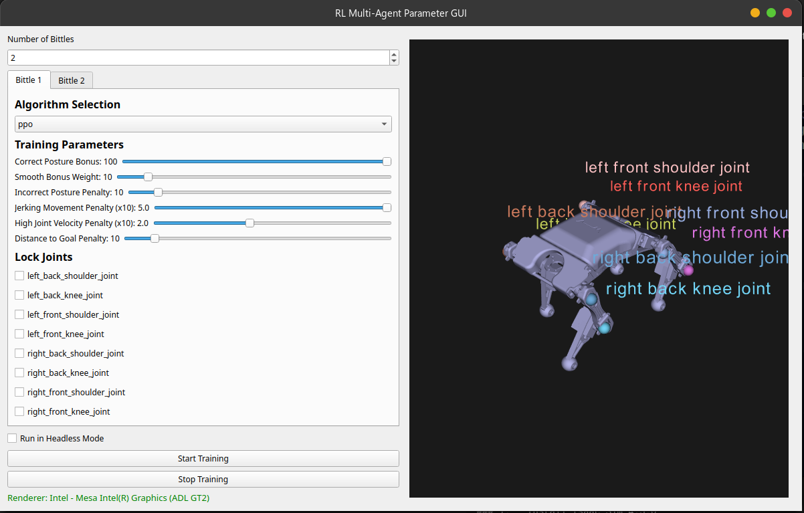
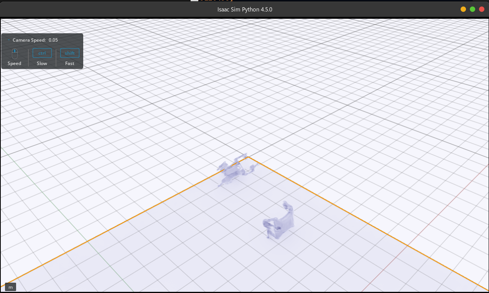
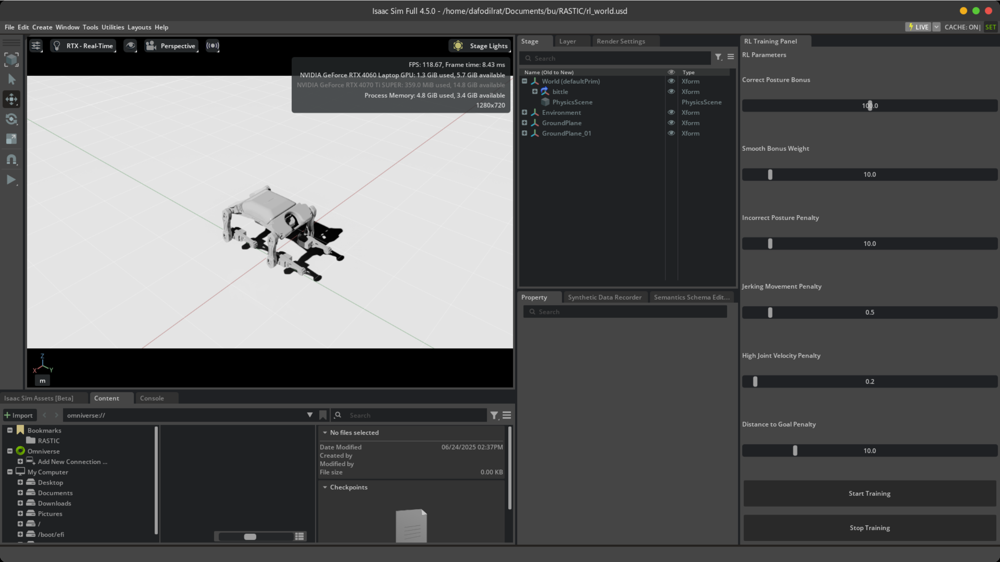
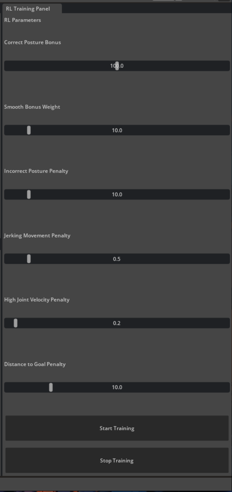

# 🦾 Isaac Sim Bittle RL Training Interface

This project enables reinforcement learning (RL) training of the Bittle quadruped robot in NVIDIA Isaac Sim using Proximal Policy Optimization (PPO) or DDPG. It now features a **standalone PyQt5 GUI** for multi-agent parameter tuning and training orchestration, making Isaac Sim integration modular and flexible.




---

## 🧩 Key Features

- ✅ **PyQt5 GUI** for configuring multiple Bittle agents:
  - Set reward weights, lock joints, and choose RL algorithms (PPO or DDPG)
  - Visualize joint positions and labels on a 3D model
  - Launch training in Isaac Sim with a single click
- ✅ Multi-agent training with `Gymnasium`-compatible environments
- ✅ Modular agent support (PPO + DDPG with Stable Baselines3)
- ✅ Live IMU-based observation, articulated control, and reward shaping
- ✅ Generates logs compatible with TensorBoard
- ⚠️ **[Broken] Isaac Sim Extension GUI**:
  - The older `RL Viewport` extension is currently deprecated and unstable. See `ext.py` for legacy support.

---

## 🛠️ Setup

### 1. **Install Isaac Sim 4.5.0**
Download the standalone version from [NVIDIA Developer](https://developer.nvidia.com/isaac-sim).

### 2. **Set Up Environment Variable**
Set an environment variable called `ISAACSIM_PATH` pointing to your Isaac Sim install path:
```bash
export ISAACSIM_PATH=/path/to/your/isaac-sim
```

You can add this to your shell config (`.bashrc`, `.zshrc`, etc.).

### 3. **Clone the Repository**
Clone the repo *inside* your Isaac Sim folder as `alpha`:
```bash
cd $ISAACSIM_PATH
git clone https://github.com/your-username/isaac-bittle-rl-extension.git alpha
```

This ensures all hardcoded paths in training scripts resolve correctly.

### 4. **Install Python Dependencies**
Use Isaac Sim's Python:
```bash
$ISAACSIM_PATH/python.sh -m pip install stable-baselines3[extra] gymnasium scipy numpy PyQt5 vtk
```

---

## 🧠 Reward Function (Used in Both Agents)

```python
reward = (
    + upright_bonus * weight[0]
    + smooth_bonus * weight[1]
    - posture_penalty * weight[2]
    - jerk_penalty * weight[3]
    - velocity_penalty * weight[4]
    - distance_to_goal * weight[5]
)
```

Each term's contribution can be adjusted using sliders in the GUI.

---

## 🚀 How to Train

### Option A: **Using PyQt5 GUI (Recommended)**

```bash
$ISAACSIM_PATH/python.sh alpha/pyqt_interface.py
```

Steps:
1. Select number of Bittle agents.
2. Adjust reward weights, joint locks, and algorithms.
3. Click **Start Training** to launch Isaac Sim and begin learning.

Models are saved as:
```
ppo_bittle_agent_0.zip
ppo_bittle_agent_1.zip
...
```

### Option B: **Manual Script Launch (Advanced)**

You can run the training script directly:
```bash
$ISAACSIM_PATH/python.sh alpha/test.py
```

Make sure to prepopulate `params.json` with the correct format as generated by the GUI.

---

## 📉 TensorBoard Logging

Logs are saved to:
- `ppo_logs/` for PPO agents
- `dp3d_logs/` for DDPG agents

View them with:
```bash
tensorboard --logdir=ppo_logs/
```

---

## ⚠️ Legacy GUI Extension (Broken)

The `RL Viewport` Isaac Sim extension (`ext.py`) is currently:
- Buggy due to recent API changes
- Non-functional with multiple agents or stop/start interaction
- Kept in repo for future reference and debugging

Use the PyQt5 interface for all current workflows.




---

## 📜 License

MIT License – see `LICENSE` file.

---

## 🙏 Acknowledgments

Built using:
- [NVIDIA Isaac Sim](https://developer.nvidia.com/isaac-sim)
- [Stable Baselines3](https://github.com/DLR-RM/stable-baselines3)
- [Petoi Bittle](https://www.petoi.com)
